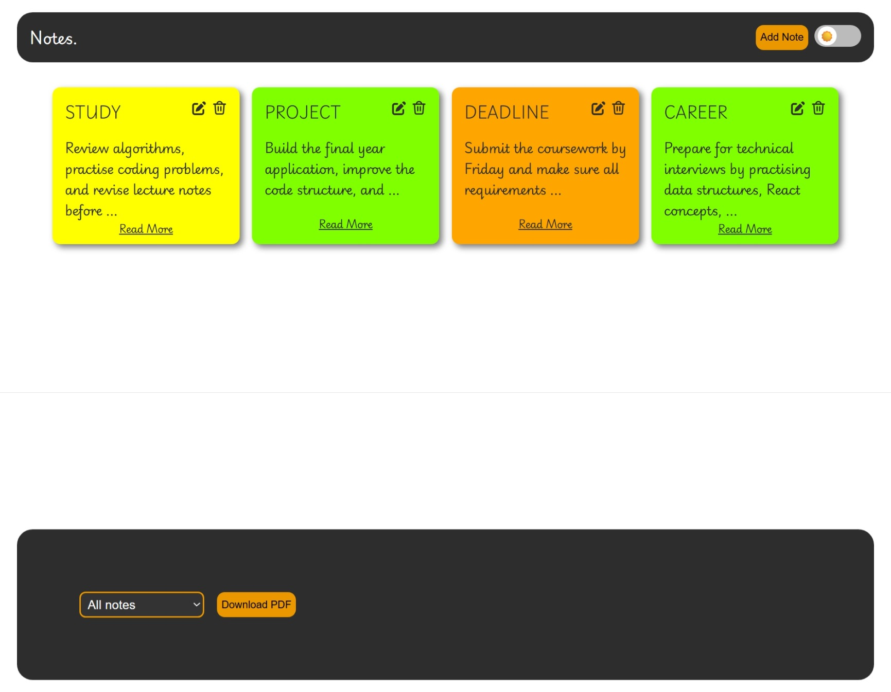
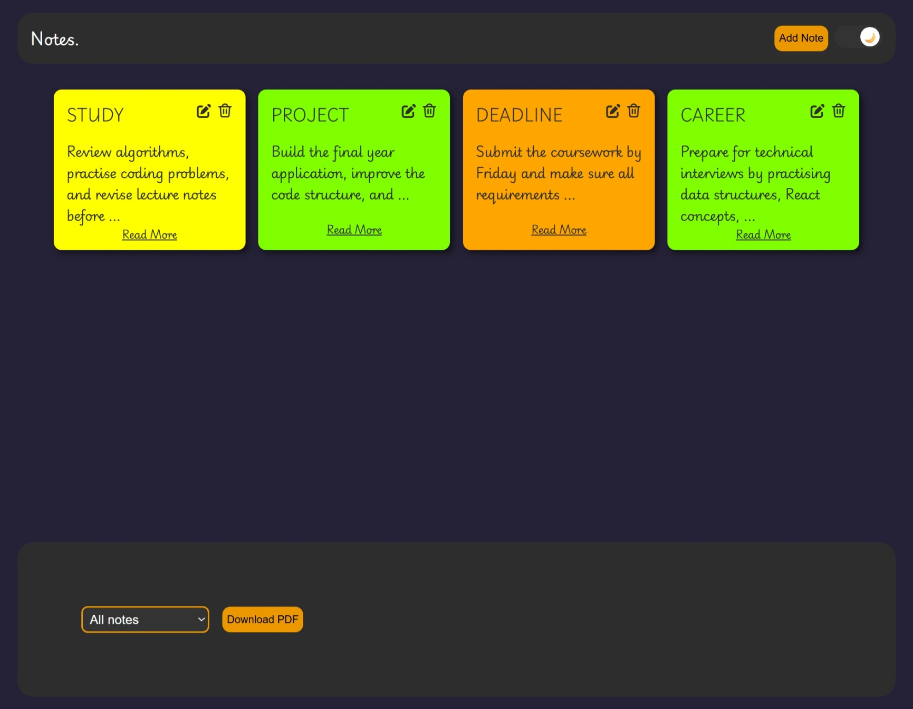
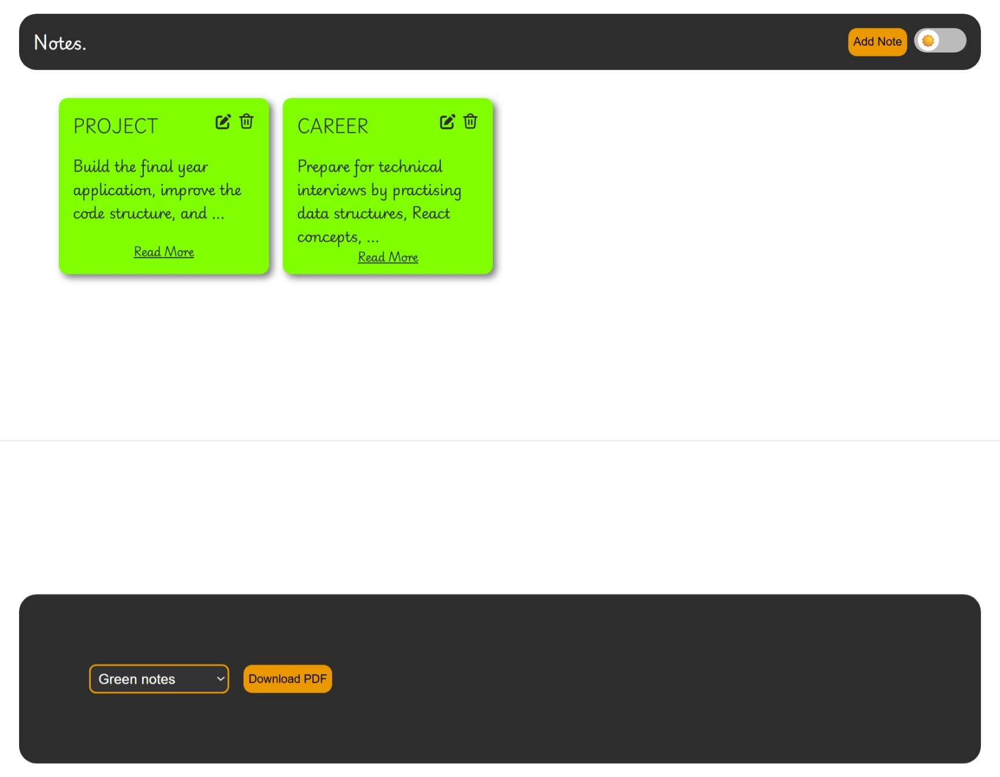

# React Notes App 📝

A fully interactive notes management application built with React.

Users can create, edit, delete, filter, and export notes while switching between light and dark themes.

This project demonstrates reusable React components, component composition, state management, React hooks, and client-side data persistence.

---

## 🚀 Live Demo

[Add live demo link here]

---

## 📸 Screenshots

### Light Mode



### Dark Mode



### Notes & Editing



---

# Features

- Create, edit, delete and view notes
- Add note title, content and colour selection
- Filter notes by colour:
  - Yellow
  - Orange
  - Green
- Download notes as PDF
- Light/dark mode toggle
- Save notes and theme preference using localStorage

---

# Technical Highlights

## React Development

Built using:

- JSX
- Functional components
- Props
- Children prop
- `useState`
- `useEffect`

---

## Component Architecture

The application uses reusable components including:

- Note cards
- Forms
- Filters
- Modal components
- Theme controls

A reusable modal component uses the `children` prop and is shared across:

- Adding new notes
- Editing notes
- Viewing full note details

This demonstrates component composition and avoiding duplicated UI logic.

---

## State & Data Persistence

- React state manages notes, forms, filters, modal visibility, and themes
- `localStorage` persists notes and user preferences
- Browser APIs are used for client-side functionality

---

# Technologies

- React
- JavaScript (ES6+)
- JSX
- CSS
- Create React App

---

# Installation

```bash
git clone <repository-url>

cd react-notes-app

npm install

npm start
```

---

# 👨‍💻 Author

Your Name: Usman Iqbal

GitHub: https://github.com/Usman-Iqbal-5
